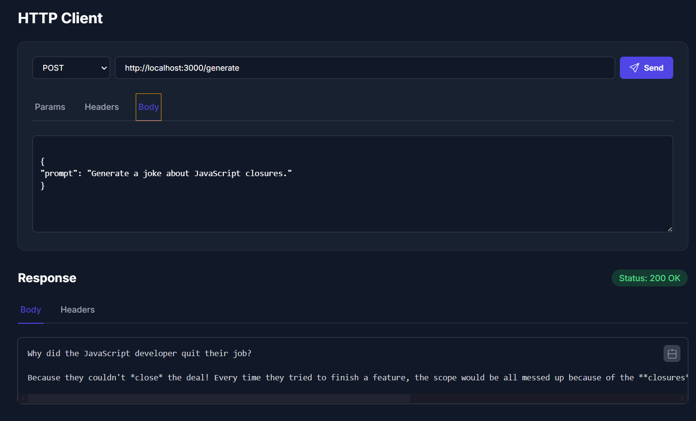

# HTTP Client for VS Code

A modern, powerful HTTP client extension for Visual Studio Code, inspired by Postman—right inside your editor. Effortlessly send HTTP requests, inspect responses, and supercharge your API development workflow without ever leaving VS Code.

---


[Get the extension from the VS Code Marketplace](https://marketplace.visualstudio.com/items?itemName=shannii.http-client-pro-extension)


## 📦 Available on the VS Code Marketplace





## 🚀 Features

- **Supports all major HTTP methods:** GET, POST, PUT, DELETE, PATCH, HEAD, OPTIONS
- **Custom Headers:** Add/edit/remove request headers easily
- **Request Body:** Send raw JSON, form data, or plain text with POST, PUT, PATCH
- **Response Viewer:** See status, headers, and beautifully formatted response body
- **Integrated UI:** Clean, intuitive, and native VS Code interface
- **History** *(coming soon)*: Quickly re-run or manage previous requests
- **Save Requests** *(planned)*: Organize and reuse your API requests

---

## 🛠️ Getting Started

### Installation

1. **Clone this repository**  
   ```sh
   git clone https://github.com/JustM3Sunny/http.client.Extention.git
   ```
2. **Open the folder in VS Code**
3. **Install dependencies**  
   ```sh
   npm install
   ```
4. **Start the extension in debug mode**  
   Press `F5` in VS Code.  
   This opens a new Extension Development Host window with the extension activated.

### Usage

1. Open the Command Palette with <kbd>Ctrl</kbd>+<kbd>Shift</kbd>+<kbd>P</kbd> (Windows/Linux) or <kbd>Cmd</kbd>+<kbd>Shift</kbd>+<kbd>P</kbd> (Mac)
2. Type `HTTP Client: Open View` and hit Enter
3. The HTTP Client panel opens in the Activity Bar/sidebar
4. Enter your request URL, select HTTP method, add headers/body as needed
5. Click **Send** and view the response below

#### ➕ Adding Headers

- Switch to the **Headers** tab
- Click **+ Add Header** to insert a new row
- Provide header name and value

#### 📝 Sending Request Body

- Choose a method that supports bodies (POST, PUT, PATCH)
- Go to the **Body** tab
- Enter your data (JSON supported)
- Click **Send**

---

## 🧑‍💻 Contributing

Contributions, suggestions, and feature requests are **very welcome!**

- Fork the repo: [https://github.com/JustM3Sunny/http.client.Extention.git](https://github.com/JustM3Sunny/http.client.Extention.git)
- Create a branch, commit your changes, and open a pull request
- Please file issues for bugs or enhancement ideas

Check out the [issues section](https://github.com/JustM3Sunny/http.client.Extention.git/issues) to get started!

---

## 📄 Requirements

- **VS Code** v1.60.0 or higher
- **Node.js** v14.x or higher

---

## 📦 Building for Production

1. **Install dependencies**  
   ```sh
   npm install
   ```
2. **Package the extension**  
   ```sh
   npm run package
   ```
   The VSIX file will be generated in the root directory.

---

## 👤 Author

**Sunny**  
GitHub: [JustM3Sunny](https://github.com/JustM3Sunny)

---

## 📝 License

This project is licensed under the MIT License.
